# Onkar Shelke

**Site Reliability Engineer** · Kubernetes · Cloud native · Open source

I keep production Kubernetes fleets healthy and fix the open source tools they run on.

<a href="#about">About</a> ·
<a href="#experience">Experience</a> ·
<a href="#open-source">Open source</a> ·
<a href="#community">Talks and mentoring</a> ·
<a href="#projects">Projects</a> ·
<a href="#writing">Writing</a> ·
<a href="#certifications">Certifications</a> ·
<a href="#stack">Stack</a>

## 👋 About me

I'm an SRE based in Pune, India. At **[Obmondo](https://obmondo.com)** I ran a GitOps fleet of **50+ production Kubernetes clusters** across AWS, Azure, Hetzner and bare metal, and owned the storage underneath it. At the same time I was a maintainer of **[KubeStellar](https://kubestellar.io)**, a CNCF Sandbox project, where I also mentored LFX contributors. In 2026 I completed **Google Summer of Code** with the JBoss Community, contributing to jws-diag, a diagnostic CLI for Red Hat's JBoss Web Server.

- 🔧 **Now:** contributing upstream to Kubernetes SIG projects (Kueue, kind, Kubebuilder), Hive and jws-diag
- ✍️ **Writing:** debugging stories from Kubernetes and Prometheus on [dev.to](https://dev.to/onkar_s)
- 🤝 **Open to:** SRE, Platform and Infrastructure roles. Remote in any time zone, or on site in Pune or Bangalore.

| 🧭 Quick facts | |
|:--|:--|
| **Roles I'm targeting** | Site Reliability Engineer · Platform Engineer · Infrastructure Engineer |
| **Experience** | SRE at Obmondo · KubeStellar maintainer and LFX mentor · CNCF LFX intern · GSoC 2026 |
| **Production scale** | 50+ Kubernetes clusters · 150+ nodes · 8+ enterprise tenants · 524.8 TB of ZFS storage |
| **Open source** |   |
| **Certifications** | CKA · KCNA · AWS Solutions Architect Associate · RHCSA |
| **Speaking** | KCD Delhi 2026 · Cloud Native Pune |
| **Education** | B.E. Computer Engineering, PDEA College of Engineering, Pune · 2026 · CGPA 8.46 |
| **Location** | Pune, India (IST, UTC+5:30) |

## ⚙️ Production experience

**Site Reliability Engineer · [Obmondo](https://obmondo.com)** · remote · 2025 to 2026

- Ran a multi-cloud GitOps fleet of **50+ production Kubernetes clusters** on AWS, Azure, Hetzner and bare metal for **8+ enterprise tenants**, shipping **30+ Helm applications** through ArgoCD and Puppet across **150+ nodes**.
- Owned the storage stack: **Ceph** (25+ runbooks, OSD recovery in rescue mode, live Docker to containerd migration), **ZFS RAID-Z3** pools holding **524.8 TB** on 48-disk configs, and **Harbor** (database moved to CloudNativePG, garbage collection freeing 194 GB+ per cycle).
- Led the RCA for a platform outage caused by two failures at once: Cilium config drift (a missing `--devices` flag) and a ZFS LocalPV DaemonSet scheduling mistake that evicted a Redis StatefulSet. Service was back in **3 hours** through ArgoCD reconciliation and node label fixes.

## 🌍 Open source

The counts below are live. Click any number to see the pull requests behind it.

| Project | My role | Merged PRs | What I worked on |
|:--|:--|:--:|:--|
| **[KubeStellar](https://github.com/kubestellar/ui)** CNCF Sandbox · multi-cluster Kubernetes | Maintainer ([UI approver](https://github.com/kubestellar/ui/pull/844), 2025 to 2026) and LFX mentor |  | Multi-cluster topology views, in-browser pod logs and exec, Helm chart deployment tab. Reviewed [50+ contributor PRs](https://github.com/search?q=commenter%3Aonkar717+org%3Akubestellar+is%3Apr+is%3Amerged+-author%3Aonkar717&type=pullrequests) and onboarded 6+ new contributors. |
| **[jws-diag](https://github.com/web-servers/jws-diag)** Red Hat JBoss Web Server (Tomcat) | [GSoC 2026](https://summerofcode.withgoogle.com/programs/2026/projects/NrlNs8B1) contributor |  | `summary`, `config`, `logs`, `diff` and `instances` commands, a server.xml parser that applies Tomcat defaults, TLS parsing with credential redaction, and an 80% test coverage gate. |
| **[Kueue](https://github.com/kubernetes-sigs/kueue)** Kubernetes SIG Scheduling | Contributor |  | Fixed silently dropped errors in SparkApplication volumes. Tests for the kueueviz backend. |
| **[Apache Tomcat](https://github.com/apache/tomcat)** | Contributor |  | Unit tests for six valves, including AccessLogValve, PersistentValve and SemaphoreValve. |
| **[Hive](https://github.com/hivecommons/hive)** AI agent orchestration for OSS maintainers | Contributor |  | Self-hosted Kubernetes fixes: RBAC steps, storage and probe docs, image pull policy. |
| **[OpenEverest](https://github.com/openeverest/openeverest)** CNCF Sandbox · databases on Kubernetes | Contributor |  | Event replay buffer so reconnecting subscribers don't lose events. |
| **[Apache SkyWalking BanyanDB](https://github.com/apache/skywalking-banyandb)** | Contributor |  | Dynamic reload of TLS certificates and keys. |

#### ✅ Latest merged

<!-- MERGED:START -->
- [fix: always pull the floating hive image in the self-hosted Deployment](https://github.com/hivecommons/hive/pull/9334) · [hivecommons/hive](https://github.com/hivecommons/hive) · merged 28 Sep 2026
- [docs: fix README Kubernetes storage and probe details](https://github.com/hivecommons/hive/pull/9176) · [hivecommons/hive](https://github.com/hivecommons/hive) · merged 28 Sep 2026
- [docs: apply RBAC manifests in README Kubernetes steps](https://github.com/hivecommons/hive/pull/9168) · [hivecommons/hive](https://github.com/hivecommons/hive) · merged 27 Sep 2026
- [Use the shared instance lookup in CONN-006 and finish the AGENTS.md update](https://github.com/web-servers/jws-diag/pull/68) · [web-servers/jws-diag](https://github.com/web-servers/jws-diag) · merged 23 Sep 2026
- [Check the Tomcat process user in SEC-001, not the user running jws-diag](https://github.com/web-servers/jws-diag/pull/67) · [web-servers/jws-diag](https://github.com/web-servers/jws-diag) · merged 22 Sep 2026
- [Read listening sockets from /proc instead of binding ports in CONN-006](https://github.com/web-servers/jws-diag/pull/65) · [web-servers/jws-diag](https://github.com/web-servers/jws-diag) · merged 22 Sep 2026
<!-- MERGED:END -->

#### 🔄 In review

<!-- REVIEW:START -->
- [kueueviz: return clusterQueueName and preemption in workload details](https://github.com/kubernetes-sigs/kueue/pull/16279) · [kubernetes-sigs/kueue](https://github.com/kubernetes-sigs/kueue) · opened 28 Sep 2026
- [kueueviz: add unit tests for local queue, namespace and flavor handlers](https://github.com/kubernetes-sigs/kueue/pull/16278) · [kubernetes-sigs/kueue](https://github.com/kubernetes-sigs/kueue) · opened 28 Sep 2026
- [kueueviz: add unit tests for cluster queue and cohort handlers](https://github.com/kubernetes-sigs/kueue/pull/16277) · [kubernetes-sigs/kueue](https://github.com/kubernetes-sigs/kueue) · opened 28 Sep 2026
- [fix: replace deprecated commonLabels in the kustomize base](https://github.com/hivecommons/hive/pull/9335) · [hivecommons/hive](https://github.com/hivecommons/hive) · opened 28 Sep 2026
- [fix(tls): find the keystore Tomcat actually uses](https://github.com/web-servers/jws-diag/pull/70) · [web-servers/jws-diag](https://github.com/web-servers/jws-diag) · opened 24 Sep 2026
<!-- REVIEW:END -->

<b>Selected pull requests, grouped by the kind of work</b> (click to expand)

 

**Reliability fixes**
- [openeverest#2591](https://github.com/openeverest/openeverest/pull/2591): replay buffer so subscribers that reconnect don't lose events
- [kueue#13548](https://github.com/kubernetes-sigs/kueue/pull/13548): stop silently dropping errors in SparkApplication `addVolumes`
- [skywalking-banyandb#642](https://github.com/apache/skywalking-banyandb/pull/642): reload TLS certificates and keys without a restart
- [hive#9334](https://github.com/hivecommons/hive/pull/9334): always pull the floating image in the self-hosted Deployment
- [jws-diag#65](https://github.com/web-servers/jws-diag/pull/65): read listening sockets from `/proc` instead of binding ports
- [jws-diag#67](https://github.com/web-servers/jws-diag/pull/67): check the Tomcat process user, not the user running the tool

**Features**
- jws-diag commands: [`summary`](https://github.com/web-servers/jws-diag/pull/7), [`config`](https://github.com/web-servers/jws-diag/pull/11), [`logs`](https://github.com/web-servers/jws-diag/pull/18), [`diff`](https://github.com/web-servers/jws-diag/pull/20), [`instances`](https://github.com/web-servers/jws-diag/pull/21)
- [jws-diag#9](https://github.com/web-servers/jws-diag/pull/9) and [#10](https://github.com/web-servers/jws-diag/pull/10): server.xml parser with Tomcat defaults, TLS parsing and credential redaction
- [jws-diag#36](https://github.com/web-servers/jws-diag/pull/36): one exit code contract across every command
- [kubestellar/ui#357](https://github.com/kubestellar/ui/pull/357): WDS and WECS topology views
- [kubestellar/ui#426](https://github.com/kubestellar/ui/pull/426) and [#434](https://github.com/kubestellar/ui/pull/434): deploy workloads from Helm charts, popular charts section
- [kubestellar/ui#761](https://github.com/kubestellar/ui/pull/761) and [#893](https://github.com/kubestellar/ui/pull/893): object summary tab, pod logs and exec

**Tests and quality**
- [jws-diag#27](https://github.com/web-servers/jws-diag/pull/27): JaCoCo reporting with an 80% instruction coverage floor
- [tomcat#965](https://github.com/apache/tomcat/pull/965), [#976](https://github.com/apache/tomcat/pull/976), [#979](https://github.com/apache/tomcat/pull/979): tests for JsonErrorReportValve, FilterValve, ProxyErrorReportValve, SemaphoreValve, AccessLogValve and PersistentValve
- [wildfly-elytron#2422](https://github.com/wildfly-security/wildfly-elytron/pull/2422): tests for OidcClientUriBuilder
- [kueue#13488](https://github.com/kubernetes-sigs/kueue/pull/13488) and [#13550](https://github.com/kubernetes-sigs/kueue/pull/13550): kueueviz handler tests, a fixed sleep replaced with a stability poll

**Community**
- [cncf/mentoring#1464](https://github.com/cncf/mentoring/pull/1464) and [#1472](https://github.com/cncf/mentoring/pull/1472): LFX mentorship projects for KubeStellar UI (Developer Relations, Model Context Protocol)

## 🎤 Talks and mentoring

- **KCD Delhi 2026** (21 Feb 2026): *AI-Assisted Kubernetes Policy Management with Kyverno*, with Akshay Kumar. [Agenda](https://www.kcddelhi.com/#agenda)
- **Cloud Native Pune (CNCG x Docker):** KubeStellar for multi-cluster and edge workload placement
- **LFX Mentorship, CNCF:** mentor on 4 KubeStellar UI projects in 2025, including the Developer Relations and Community Growth track
- **GeeksforGeeks Campus Mantri:** ran coding workshops and contests at my college

## 🛠️ Projects

<table>
  <tr>
    <td width="46%" valign="top">
      
    </td>
    <td valign="top">
      <h3><a href="https://github.com/onkar717/VisualEyes">VisualEyes</a></h3>
      
Open source observability platform for Kubernetes with an AI-assisted incident response engine.

      <ul>
        <li>Go multi-module backend with system and Kubernetes agents, Prometheus metrics and a 12-command Bubbletea CLI</li>
        <li>6-agent RCA pipeline (CrewAI) that streams progress over SSE and classifies incidents SEV1 to SEV4</li>
        <li>7 guarded kubectl remediation tools behind a shell-injection allowlist, with Slack alerts on SEV1 and SEV2</li>
      </ul>
      
Go · Python · CrewAI · Kubernetes · Prometheus · PostgreSQL · SQLite

    </td>
  </tr>
</table>

## ✍️ Writing

<!-- POSTS:START -->
- [Deleting the corrupted chunk file made it worse](https://dev.to/onkar_s/deleting-the-corrupted-chunk-file-made-it-worse-2oah) · 26 Sep 2026
- [Kubelet watches inodes. Just not until it's an emergency.](https://dev.to/onkar_s/kubelet-watches-inodes-just-not-until-its-an-emergency-351c) · 17 Sep 2026
<!-- POSTS:END -->

## 📜 Certifications

<table>
  <tr>
    <td align="center" width="180">
       
      <b>CKA</b> 
      Certified Kubernetes Administrator 
      <a href="https://www.credly.com/badges/9d349beb-80d9-41e9-b82a-2980e2340683/public_url">Verify on Credly</a>
    </td>
    <td align="center" width="180">
       
      <b>KCNA</b> 
      Kubernetes and Cloud Native Associate 
      <a href="https://www.credly.com/badges/fced15ec-f770-4c85-ad57-2817ad97f5e5/public_url">Verify on Credly</a>
    </td>
    <td align="center" width="180">
       
      <b>AWS SAA</b> 
      Solutions Architect Associate 
      SAA-C03
    </td>
    <td align="center" width="180">
       
      <b>RHCSA</b> 
      Red Hat Certified System Administrator 
      EX200
    </td>
  </tr>
</table>

## 🧰 Stack

   
   
  

| Area | Tools |
|:--|:--|
| **Kubernetes** | Kubernetes, Cluster API, Helm, ArgoCD, Cilium, Kyverno, Velero |
| **Storage and data** | Rook-Ceph, ZFS, Harbor, CloudNativePG, PostgreSQL, Redis, MongoDB, MySQL, OpenSearch |
| **Observability** | Prometheus, Grafana, Alertmanager, incident response and RCA |
| **Cloud and IaC** | AWS, Azure, GCP, Hetzner, bare metal, Terraform, Puppet |
| **CI/CD** | GitHub Actions, Jenkins, SonarQube, Docker |
| **Languages** | Go, Java, Python, TypeScript, JavaScript, C/C++, Bash |

## 📈 Contribution activity

<picture>
  <source media="(prefers-color-scheme: dark)" srcset="https://raw.githubusercontent.com/onkar717/onkar717/output/snake-dark.svg" />
  <source media="(prefers-color-scheme: light)" srcset="https://raw.githubusercontent.com/onkar717/onkar717/output/snake.svg" />
  
</picture>

---

**Hiring for SRE or platform work?** Email [onkarwork2234@gmail.com](mailto:onkarwork2234@gmail.com) or message me on [LinkedIn](https://www.linkedin.com/in/onkar-shelke-55531024a/).

The merged PRs, PRs in review, posts and contribution graph refresh every day through a GitHub Actions workflow in this repo.

